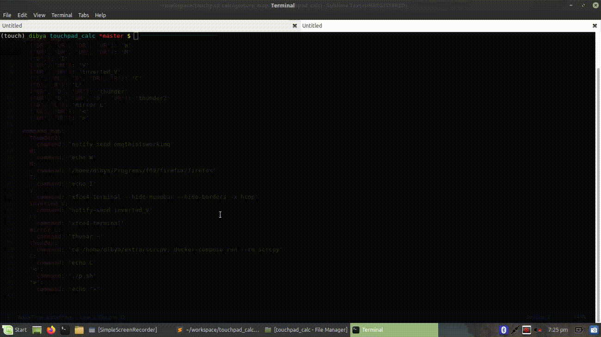

## Midas - Touchpad gesture detection utility

Midas is gesture detection program written in Python that runs in the background silently tracking touchpad for gestures and executes the corresponding commands according to the mapping defined. 

The gesture mapping is defined as directions mapped to commands in the `gesture_map.yml` file.  You can create your own gestures by using the cardinal & ordinal directions D, U, R, L, DR, DL, UR and UL. So for a new gesture resembles  Thunder, add `('UR', 'D', 'UR') : thunder` under `gesture_map` and add the corresponding command under `command_map`  as `thunder:'echo my_command_here'` and it is readily available the next time you trigger the detection.  

To trigger the detection, tap & hold the extreme top right corner of the touchpad for 0.3s until a notification appears. The mouse pointer is grabbed and no longer responds because the background process is processing all the touchpad input. Draw the gesture and you see a notification saying what gesture has been detected. To confirm its execution, tap the touchpad within a sec of the notification appearing. If not, the gesture is refreshed, useful when wrong gesture has been detected. To stop the detection, tap & hold the same extreme corner for 0.3s until the notification appears.

Here's what it might look like :

```yaml
gesture_map:
    ('DR', 'UR'): 'V'
    ('UR', 'DR'): 'inverted_V'
    ('UR', 'DR', 'UR', 'DR'): 'M'
command_map:
    V:
      command: 'xfce4-terminal'
    inverted_V:
      command: 'googlechrome'
    M:
      command: './myscript.sh'
```

The above file is reloaded every time the gesture detection is triggered so no need to worry about re-starting the process. Here's a GIF showing how it works.
<h3 align="center"></h3>

#### Installation:
Ideally, it should be running as a startup script in the background. You can set in your DE or install it as systemd service for more robust control. 

The code needs more documentation and refactoring and is open for PRs and issues. Cheers :beers: !
##### Footnote:

I wrote this as an exercise while learning about the asyncio library and thus it is extensively used in this. It is single threaded has a low memory footprint. Since I am not an expert in async programs there might be many bugs in this so please let me know by creating an issue that you find. 